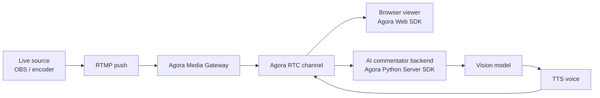

<div align="center">

# WorldCupVoice

**AI live commentator for sports streams.**

Add real-time AI commentary to a live feed: the AI watches the same RTC video as
viewers and speaks over the action live. The World Cup is the showcase scenario,
but the same pipeline works for any live stream.

[](./LICENSE)


**English** · [简体中文](./README.zh-CN.md)

</div>

---

WorldCupVoice is a live AI commentator for sports streams: the broadcast enters a
real-time media channel, the AI watches the same feed as viewers, and generated
speech returns to the room as live commentary.

It is built for live sports moments like the World Cup, and one use case it fits
especially well is accessibility: AI live commentary can give blind and
low-vision fans field-level detail that human live commentary often skips, such
as where the ball is, which side pressure is forming from, and who is making a
run. The goal is not to replace human commentators.

## Demo

Watch WorldCupVoice turn a live match feed into AI commentary:

https://github.com/user-attachments/assets/307ca759-29f7-40d8-b3be-e9d5e5104e48

## Architecture



Runtime roles:

- Live feed: the RTMP/Gateway publisher inside the RTC channel.
- AI commentator: the backend participant that samples frames, writes the call,
  and publishes generated speech.
- Browser viewer: the web client that plays the live feed, AI audio, transcript,
  and booth status.

## Features

- Live AI play-by-play from the same RTC feed viewers are watching.
- Any live source (OBS, encoder, ...) ingests through RTMP and Agora Media Gateway.
- Server-side frame sampling for visually grounded match commentary.
- Configurable commentator voice with OpenAI TTS, ElevenLabs, or Fish Audio.
- AI audio published back into RTC with synced transcript and booth status.
- Explicit `Start AI` / `Stop AI`, viewer heartbeat, and hard session TTL to
  control AI spend.

## Quick Start

### Frontend Env

Install frontend dependencies:

```bash
pnpm install
cp .env.example .env.local
```

Fill `.env.local`:

Generate one backend secret first:

```bash
openssl rand -hex 32
```

Paste the same generated value into both frontend and backend env files:

```bash
NEXT_PUBLIC_AGORA_APP_ID=
NEXT_AGORA_APP_CERTIFICATE=
AGENT_BACKEND_URL=http://localhost:8000
BACKEND_API_SECRET=<same-generated-secret>
ACCESS_PASSWORD=<choose-a-local-access-code>
```

`NEXT_AGORA_APP_CERTIFICATE` (frontend) and `AGORA_APP_CERTIFICATE` (backend) are
the same Agora certificate, named per each side's convention.

Optional overrides:

```bash
NEXT_PUBLIC_LIVE_CHANNEL_NAME=worldcup-live
NEXT_PUBLIC_MATCH_FEED_UID=234567
NEXT_PUBLIC_AGENT_UID=123456
# Signs the access cookie. Optional locally (defaults to ACCESS_PASSWORD); set a
# dedicated value in production and add it to Vercel.
ACCESS_SESSION_SECRET=
```

### Backend

Prepare the backend environment:

```bash
cd server
python -m venv .venv
source .venv/bin/activate
pip install -r requirements.txt -r requirements-dev.txt
cp .env.example .env.local
```

Fill `server/.env.local`:

```bash
AGORA_APP_ID=
AGORA_APP_CERTIFICATE=
BACKEND_API_SECRET=<same-generated-secret>
OPENAI_API_KEY=
```

### TTS Voice

The default OpenAI TTS path is enough to run the project, but the voice is a big
part of the AI commentator effect. For demos and production-style streams,
ElevenLabs is recommended because a purpose-built sportscaster voice makes the
commentary feel far more like a real broadcast booth.

Fish Audio can also be used as the TTS provider, and is worth trying for Chinese
commentary voices:

```bash
TTS_PROVIDER=fish_audio
FISH_AUDIO_API_KEY=
FISH_AUDIO_VOICE_ID_ZH_MEME=
FISH_AUDIO_VOICE_ID_ZH_TACTICAL=
```

The open-source project ships commentator profiles and prompts, not private
voice IDs. Create your own Fish Audio voice and put its ID in the matching env
variable. If neither a profile-specific nor generic third-party voice ID is configured,
the backend falls back to OpenAI TTS so local setup still works.

Built-in profile voice variables:

| Profile | Provider | Voice env |
| --- | --- | --- |
| Chinese Meme Commentary | Fish Audio | `FISH_AUDIO_VOICE_ID_ZH_MEME` |
| Chinese Tactical Commentary | Fish Audio | `FISH_AUDIO_VOICE_ID_ZH_TACTICAL` |
| English Sportscaster | ElevenLabs | `ELEVENLABS_VOICE_ID_EN_SPORTSCASTER` |

Create your own ElevenLabs voice and put its voice ID in `server/.env.local`:

```bash
TTS_PROVIDER=elevenlabs
ELEVENLABS_API_KEY=
ELEVENLABS_VOICE_ID=
ELEVENLABS_VOICE_ID_EN_SPORTSCASTER=
```

In ElevenLabs:

1. Open **VoiceLab**.
2. Click **Create Voice**.
3. Choose **Voice Design**.
4. Paste the prompt below and generate a sportscaster voice.
5. Save the voice, then copy its **Voice ID** into `ELEVENLABS_VOICE_ID`.

The ElevenLabs voice prompt used to generate the voice in the demo:

```text
Native English, neutral American broadcast style. Male, 35-50. Broadcast quality.

Persona: elite sports commentator. Emotion: explosive, urgent, passionate.

A powerful, resonant, high-energy voice built for live football and basketball commentary. Deep but agile timbre, crisp articulation, close-mic broadcast presence, and clean studio-quality audio. Speaks at a fast, rhythmic pace during live action, with sudden bursts of excitement, sharp emphasis on player names, and dramatic pauses after huge moments. The delivery should feel like a professional television play-by-play announcer calling a World Cup final: intense, emotionally invested, breathless during attacks, and thunderous when a goal or game-changing moment happens.
```

Start the backend after the env file is filled:

```bash
python -m uvicorn app.main:app --reload --host 127.0.0.1 --port 8000
```

### Run The App

Start the frontend:

```bash
pnpm dev
```

Open [http://localhost:3000](http://localhost:3000), enter the booth, then push
a stream from OBS or a local clip you provide.

### Media Gateway Stream Key

Agora Media Gateway needs two RTMP values: a server domain name and a streaming
key. The Console page enables Media Gateway, but it does not show a ready-made
stream key. When you use Agora's unified RTMP domain, create the stream key with
the Media Gateway REST API.

For this project, generate the key for the default live feed:

```text
Channel: worldcup-live
UID: 234567
```

If you changed `NEXT_PUBLIC_LIVE_CHANNEL_NAME` or `NEXT_PUBLIC_MATCH_FEED_UID`,
use those values instead.

In [Agora Console](https://console.agora.io/):

1. Open **Projects** from the Console sidebar and select your project.
2. Enable **Media Gateway** from the project's feature list.
3. Open **Developer Toolkit -> RESTful API** in Console and create or copy a
   Customer ID and Customer Secret. Agora documents this flow in
   [RESTful authentication](https://docs.agora.io/en/signaling/rest-api/restful-authentication).
4. Add them to local `.env.local` only:

```bash
AGORA_CUSTOMER_ID=
AGORA_CUSTOMER_SECRET=
AGORA_MEDIA_GATEWAY_REGION=<region>
```

Choose the Media Gateway region closest to your encoder or cloud RTMP source,
for example `eu`, `na`, `as`, `cn`, `jp`, or `in`.

Create the stream key:

```bash
pnpm run media-gateway:key
```

Copy the generated RTMP details into whichever source you use next:

```text
RTMP server: rtmp://rtls-ingress-prod-<region>.agoramdn.com/live
Stream key: <generated stream key>
```

Keep the Customer Secret and stream key private. Do not commit them to GitHub or
put them in Vercel.

Agora's official docs explain that the unified RTMP server uses the
`rtls-ingress-prod-<region>.agoramdn.com/live` domain and that the stream key is
created through the Media Gateway REST API. See
[Media Gateway quickstart](https://docs.agora.io/en/media-gateway/get-started/quickstart)
and [Create streaming key](https://docs.agora.io/en/media-gateway/reference/rest-api/endpoints/streaming-key/create-streaming-key).

### Choose an RTMP Source

After you have an RTMP server and stream key, choose one RTMP source:

| Source | Best for | Runs where | Notes |
| --- | --- | --- | --- |
| `pnpm run stream:sample` | Fast local smoke tests | Your laptop | Uses ffmpeg to loop a local clip you provide. Stop it with `Ctrl+C`. |
| OBS | Manual demos and real camera/screen feeds | Your laptop or encoder machine | Good for interactive control, overlays, audio routing, and screen capture. |
| StreamFlow or another cloud RTMP encoder | Longer prerecorded or scheduled streams | A VPS or cloud host | More stable than a laptop for 24/7 prerecorded streams, but still just an RTMP producer. |

All three options push to the same Agora Media Gateway RTMP server and stream
key. The app and AI commentator always consume the result as live Agora RTC
video.

### Push A Local Clip

No video is shipped with this repo — broadcast match footage is copyrighted and
cannot be redistributed, so **bring your own football clip** (any 16:9 `.mp4`).
The clip is only a local broadcast source; it is not played directly by the app.

For better commentary, describe your match first so the AI can identify
players. Each match is one JSON file under
[`data/matches/`](./data/matches/) (teams, jersey colors, rosters, storyline) —
copy `_template.json`, edit it, and register it in
[`lib/commentary.ts`](./lib/commentary.ts). See
[`data/matches/README.md`](./data/matches/README.md) for the full guide.

Install ffmpeg, then push your clip through Agora Media Gateway:

```bash
brew install ffmpeg

RTMP_STREAM_KEY=<generated stream key> \
RTMP_INPUT=/path/to/your-match.mp4 \
pnpm run stream:sample
```

If `RTMP_INPUT` is unset, the script streams the first `.mp4` it finds in
`samples/`. It loops the clip until you press `Ctrl+C`; the browser and AI
commentator receive it as live Agora RTC video.

> The clip used during local testing came from
> <https://www.youtube.com/watch?v=RgqKdplLIk4>. Obtain and use any third-party
> footage at your own responsibility.

### Cloud RTMP With StreamFlow

[StreamFlow](https://github.com/bangtutorial/streamflow) is an optional
self-hosted web app for managing prerecorded live streams. It provides video
upload/management, scheduled streaming, loop mode, bitrate/FPS/resolution
settings, and custom RTMP output.

Use StreamFlow when you want a production-like prerecorded broadcast that keeps
running from a VPS instead of your laptop:

1. Deploy StreamFlow on a VPS or Docker host.
2. Upload your own football clip.
3. Use the RTMP server and stream key printed by `pnpm run media-gateway:key`.
4. Enable loop or schedule settings as needed.
5. Start the stream from StreamFlow.

This does not replace Agora Media Gateway. StreamFlow is only the upstream RTMP
producer; Agora Media Gateway still converts that RTMP input into the RTC feed
watched by the browser and AI commentator.

### OBS Setup

Use a custom streaming service:

```text
Service: Custom
Server: rtmp://rtls-ingress-prod-<region>.agoramdn.com/live
Stream Key: <your Agora Media Gateway stream key>
```

Recommended starting settings:

- Encoder: H.264
- FPS: 30
- Keyframe interval: 2 seconds
- Rate control: CBR
- Bitrate: 4500-6500 Kbps for 1080p
- Audio: AAC, 48 kHz

### Deployment

Frontend:

```bash
vercel link
vercel env add NEXT_PUBLIC_AGORA_APP_ID production
vercel env add NEXT_AGORA_APP_CERTIFICATE production
vercel env add AGENT_BACKEND_URL production
vercel env add BACKEND_API_SECRET production
vercel env add ACCESS_PASSWORD production
vercel env add ACCESS_SESSION_SECRET production
vercel deploy --prod
```

Backend:

- Deploy `server/` as a Railway Docker service.
- Set the variables from [`server/.env.example`](./server/.env.example).
- Use the same `BACKEND_API_SECRET` value in Railway and Vercel.
- Set frontend `AGENT_BACKEND_URL` to the Railway public URL.

## Runtime Cost Controls

The backend does not spend AI tokens just because it is deployed.

- `/sessions/start` starts the AI commentator.
- `/sessions/heartbeat` keeps it alive while a viewer is present.
- `/sessions/stop` stops it explicitly.
- `BACKEND_API_SECRET` protects the public Python backend from direct session
  control calls.
- Stale sessions stop automatically when viewer heartbeats disappear.
- Every session has a hard maximum runtime.

The timeout, model, voice, frame sampling, and audio pacing defaults live in
[`server/app/config.py`](./server/app/config.py). Override them only when you are
deliberately tuning the runtime.

The booth monitor shows whether AI is idle, waiting for video, active, stopped,
or missing.

## Project Layout

```text
app/api/                  Next.js API routes for tokens, access, and session proxying
components/               Live booth UI, transcript, metrics, and lobby
data/matches/             Per-match context (one JSON per game) sent to the AI
lib/commentary.ts         Loads the match JSON and builds the AI prompt context
server/app/               FastAPI backend and AI commentator
server/tests/             Backend smoke tests
public/                   Logos, icons, and poster imagery
```

## Roadmap

- [ ] Lower latency between the video frame and the AI commentary output.
- [ ] Multi-commentator: several AI commentators working together.
- [ ] A dedicated accessibility mode for blind and low-vision fans, with denser field/spatial detail.
- [ ] More voices and languages: different countries' languages and vocal styles.

## License

MIT
