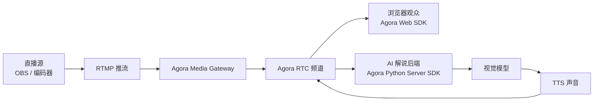

<div align="center">

# WorldCupVoice

**面向体育直播的 AI 实时解说员。**

给真实的直播流加上 AI 实时解说：AI 观看和观众相同的 RTC 画面，把生成的语音解说
送回直播间。以世界杯为示例场景，同一套链路也适用于任何直播。

[](./LICENSE)


[English](./README.md) · **简体中文**

</div>

---

WorldCupVoice 是一个面向体育直播的 AI 实时解说员：转播流进入实时媒体频道，
AI 观看和观众相同的画面，把生成的语音解说送回直播间。

它为像世界杯这样的体育直播场景而做，其中一个特别适合的场景是无障碍：AI 实时解说可以为视障观众补上真人直播解说里缺少的
球场细节（比如球在哪里、压力从哪一侧形成、谁在前插），而不是去取代真人解说员。

## 演示

这个录屏展示了 WorldCupVoice 如何把直播比赛画面变成 AI 实时解说：

https://github.com/user-attachments/assets/307ca759-29f7-40d8-b3be-e9d5e5104e48


## 架构



运行角色：

- 直播源：通过 RTMP / Media Gateway 进入 RTC 频道的比赛画面。
- AI 解说员：后端参与者，采样实时画面、生成解说，并发布 AI 声音。
- 浏览器观众：播放直播画面、AI 声音、解说文字和解说间状态。

## 功能

- 基于观众正在观看的同一路 RTC 直播画面生成 AI 解说。
- 任意直播源（OBS、编码器等）通过 RTMP 和 Agora Media Gateway 接入。
- 后端采样实时画面，让解说基于当前比赛内容。
- 可配置 OpenAI TTS、ElevenLabs 或 Fish Audio 解说音色。
- AI 声音回推到 RTC，并在前端同步展示解说文字和解说间状态。
- 显式 `Start AI` / `Stop AI`、观众心跳和最大会话时长，避免后台持续消耗
  AI token。

## 快速开始

### 前端环境变量

安装前端依赖：

```bash
pnpm install
cp .env.example .env.local
```

填写 `.env.local`：

先生成一个 backend secret：

```bash
openssl rand -hex 32
```

把同一个生成结果分别填到前端和后端环境变量里：

```bash
NEXT_PUBLIC_AGORA_APP_ID=
NEXT_AGORA_APP_CERTIFICATE=
AGENT_BACKEND_URL=http://localhost:8000
BACKEND_API_SECRET=<same-generated-secret>
ACCESS_PASSWORD=<choose-a-local-access-code>
```

`NEXT_AGORA_APP_CERTIFICATE`（前端）和 `AGORA_APP_CERTIFICATE`（后端）是同一个
Agora 证书，只是前后端各按自己的命名习惯。

可选覆盖：

```bash
NEXT_PUBLIC_LIVE_CHANNEL_NAME=worldcup-live
NEXT_PUBLIC_MATCH_FEED_UID=234567
NEXT_PUBLIC_AGENT_UID=123456
# 给 access cookie 签名。本地可选（默认回退到 ACCESS_PASSWORD）；生产环境建议
# 单独设一个值，并加到 Vercel。
ACCESS_SESSION_SECRET=
```

### 后端

准备后端环境：

```bash
cd server
python -m venv .venv
source .venv/bin/activate
pip install -r requirements.txt -r requirements-dev.txt
cp .env.example .env.local
```

填写 `server/.env.local`：

```bash
AGORA_APP_ID=
AGORA_APP_CERTIFICATE=
BACKEND_API_SECRET=<same-generated-secret>
OPENAI_API_KEY=
```

### TTS 声音

默认 OpenAI TTS 可以跑通项目，但声音很大程度决定了 AI 解说的最终效果。对于 demo
和更接近 production 的直播，推荐使用 ElevenLabs：自己生成一个体育解说风格的 voice，
会比通用 TTS 更像真实转播间。

如果你更关注中文解说音色，也可以试 Fish Audio：

```bash
TTS_PROVIDER=fish_audio
FISH_AUDIO_API_KEY=
FISH_AUDIO_VOICE_ID_ZH_MEME=
FISH_AUDIO_VOICE_ID_ZH_TACTICAL=
```

开源仓库只提供解说员角色和 prompt，不绑定你的私有 voice id。开发者需要在
Fish Audio 里创建自己的声音，再填到对应 env。某个角色没有配置专属或通用第三方 voice
id 时，后端会自动回退到 OpenAI TTS，保证本地仍能跑通。

内置 profile 的产品展示名保持英文：

| Profile | Provider | Voice env |
| --- | --- | --- |
| Chinese Meme Commentary | Fish Audio | `FISH_AUDIO_VOICE_ID_ZH_MEME` |
| Chinese Tactical Commentary | Fish Audio | `FISH_AUDIO_VOICE_ID_ZH_TACTICAL` |
| English Sportscaster | ElevenLabs | `ELEVENLABS_VOICE_ID_EN_SPORTSCASTER` |

在 ElevenLabs 里创建自己的 voice，然后把 voice ID 写到 `server/.env.local`：

```bash
TTS_PROVIDER=elevenlabs
ELEVENLABS_API_KEY=
ELEVENLABS_VOICE_ID=
ELEVENLABS_VOICE_ID_EN_SPORTSCASTER=
```

在 ElevenLabs 后台：

1. 打开 **VoiceLab**。
2. 点击 **Create Voice**。
3. 选择 **Voice Design**。
4. 输入下面这段 prompt，生成一个体育解说风格的声音。
5. 保存 voice，然后复制它的 **Voice ID** 到 `ELEVENLABS_VOICE_ID`。

我在 demo 演示里用来生成 voice 的 ElevenLabs prompt：

```text
Native English, neutral American broadcast style. Male, 35-50. Broadcast quality.

Persona: elite sports commentator. Emotion: explosive, urgent, passionate.

A powerful, resonant, high-energy voice built for live football and basketball commentary. Deep but agile timbre, crisp articulation, close-mic broadcast presence, and clean studio-quality audio. Speaks at a fast, rhythmic pace during live action, with sudden bursts of excitement, sharp emphasis on player names, and dramatic pauses after huge moments. The delivery should feel like a professional television play-by-play announcer calling a World Cup final: intense, emotionally invested, breathless during attacks, and thunderous when a goal or game-changing moment happens.
```

填好 env 之后再启动后端：

```bash
python -m uvicorn app.main:app --reload --host 127.0.0.1 --port 8000
```

### 启动应用

启动前端：

```bash
pnpm dev
```

打开 [http://localhost:3000](http://localhost:3000)，进入直播间，然后用 OBS 或你自备的
本地视频开始推流。

### Media Gateway Stream Key

Agora Media Gateway 需要两个 RTMP 值：server domain name 和 streaming key。
Console 页面只负责启用 Media Gateway，不会直接展示一个可复制的 stream key。
如果使用 Agora 统一 RTMP 域名，需要通过 Media Gateway REST API 创建 stream key。

这个项目默认的直播源是：

```text
Channel: worldcup-live
UID: 234567
```

如果你改过 `NEXT_PUBLIC_LIVE_CHANNEL_NAME` 或 `NEXT_PUBLIC_MATCH_FEED_UID`，
就用你自己的值。

在 [Agora Console](https://console.agora.io/) 中：

1. 从 Console 侧边栏打开 **Projects**，选择你的项目。
2. 在项目功能列表中启用 **Media Gateway**。
3. 在 Console 中打开 **Developer Toolkit -> RESTful API**，创建或复制 Customer ID
   和 Customer Secret。Agora 官方的
   [RESTful authentication](https://docs.agora.io/en/signaling/rest-api/restful-authentication)
   文档也说明了这一步。
4. 只在本地 `.env.local` 中加入：

```bash
AGORA_CUSTOMER_ID=
AGORA_CUSTOMER_SECRET=
AGORA_MEDIA_GATEWAY_REGION=<region>
```

选择离你的编码器或云端 RTMP source 最近的 Media Gateway region，例如 `eu`、`na`、
`as`、`cn`、`jp`、`in`。

创建 stream key：

```bash
pnpm run media-gateway:key
```

把生成出来的 RTMP 信息复制到后续选择的推流工具里：

```text
RTMP server: rtmp://rtls-ingress-prod-<region>.agoramdn.com/live
Stream key: <生成的 stream key>
```

Customer Secret 和 stream key 都要当成密钥保存，不要提交到 GitHub，也不要放进
Vercel。

Agora 官方文档说明了统一 RTMP server 使用
`rtls-ingress-prod-<region>.agoramdn.com/live` 域名，stream key 通过 Media
Gateway REST API 创建。见
[Media Gateway quickstart](https://docs.agora.io/en/media-gateway/get-started/quickstart)
和 [Create streaming key](https://docs.agora.io/en/media-gateway/reference/rest-api/endpoints/streaming-key/create-streaming-key)。

### 选择 RTMP Source

拿到 RTMP server 和 stream key 之后，可以三选一：

| Source | 适合场景 | 运行位置 | 说明 |
| --- | --- | --- | --- |
| `pnpm run stream:sample` | 快速本地 smoke test | 你的电脑 | 用 ffmpeg 循环推你自己提供的本地视频，按 `Ctrl+C` 停止。 |
| OBS | 手动演示、摄像头、屏幕、真实采集 | 你的电脑 | 适合叠加画面、音频路由、屏幕采集和人工控制。 |
| StreamFlow 或其他云端 RTMP encoder | 更长的预录播、定时直播、循环直播 | 云服务器 | 比笔记本更适合 24/7 预录播，但它本质上仍然只是 RTMP producer。 |

这三种方式都会推到同一个 Agora Media Gateway RTMP server 和 stream key。浏览器和
AI 解说员始终通过 Agora RTC 接收转换后的直播视频。

### 推送本地视频

仓库**不内置任何视频**，比赛转播画面受版权保护，所以请**自备一段足球
比赛视频**（任意 16:9 `.mp4`）。

为了让解说更准，先把你这段视频对应的比赛信息填好，AI 才能识别球员、贴合画面解说。
每场比赛是 [`data/matches/`](./data/matches/) 下的一个 JSON（两队、球衣颜色、球员名单、
剧情）：复制 `_template.json`、改成你的比赛，再在 [`lib/commentary.ts`](./lib/commentary.ts)
里 import。完整说明见 [`data/matches/README.md`](./data/matches/README.md)。

安装 ffmpeg，然后把你的视频推到 Agora Media Gateway：

```bash
brew install ffmpeg

RTMP_STREAM_KEY=<生成的 stream key> \
RTMP_INPUT=/path/to/your-match.mp4 \
pnpm run stream:sample
```

不设 `RTMP_INPUT` 时，脚本会自动推送 `samples/` 下找到的第一个 `.mp4`。脚本会循环
推送直到你按 `Ctrl+C`，浏览器和 AI 解说员通过 Agora RTC 接收直播视频。

> 本地测试用的素材来自 <https://www.youtube.com/watch?v=RgqKdplLIk4>。第三方视频的
> 获取与使用请自行承担责任。

### 用 StreamFlow 做云端 RTMP 推流

[StreamFlow](https://github.com/bangtutorial/streamflow) 是一个可选的自托管网页工具，
用于管理预录播直播。它支持视频上传/管理、定时推流、循环播放、bitrate/FPS/resolution
设置，以及自定义 RTMP 输出。

当你想做更接近 production 的预录播时，可以把 StreamFlow 部署到 VPS，而不是依赖自己电脑
一直开着：

1. 在 VPS 或 Docker host 上部署 StreamFlow。
2. 上传你自备的足球比赛视频。
3. 填入 `pnpm run media-gateway:key` 打印出的 RTMP server 和 stream key。
4. 按需要开启 loop 或 schedule。
5. 从 StreamFlow 启动推流。

这不会替代 Agora Media Gateway。StreamFlow 只是上游 RTMP producer；Agora Media
Gateway 仍然负责把 RTMP 输入转换成浏览器和 AI 解说员订阅的 RTC feed。

### OBS 设置

在 OBS 中选择自定义直播服务：

```text
Service: Custom
Server: rtmp://rtls-ingress-prod-<region>.agoramdn.com/live
Stream Key: <你的 Agora Media Gateway stream key>
```

推荐起步设置：

- 编码器：H.264
- FPS：30
- Keyframe interval：2 秒
- Rate control：CBR
- Bitrate：1080p 可先用 4500-6500 Kbps
- Audio：AAC，48 kHz

### 部署

前端部署到 Vercel：

```bash
vercel link
vercel env add NEXT_PUBLIC_AGORA_APP_ID production
vercel env add NEXT_AGORA_APP_CERTIFICATE production
vercel env add AGENT_BACKEND_URL production
vercel env add BACKEND_API_SECRET production
vercel env add ACCESS_PASSWORD production
vercel env add ACCESS_SESSION_SECRET production
vercel deploy --prod
```

后端部署到 Railway：

- 将 `server/` 作为 Docker 服务部署。
- 设置 [`server/.env.example`](./server/.env.example) 中的环境变量。
- Railway 和 Vercel 使用同一个 `BACKEND_API_SECRET`。
- 前端的 `AGENT_BACKEND_URL` 指向 Railway public URL。

## 成本控制

后端服务在线不等于 AI 一直在消耗 token。

- `/sessions/start` 启动 AI 解说员。
- `/sessions/heartbeat` 表示仍有观众在直播间。
- `/sessions/stop` 主动停止 AI 解说员。
- `BACKEND_API_SECRET` 防止别人绕过前端直接调用公开后端启动 session。
- 观众心跳消失后，后端会自动停止过期 session。
- 每个 session 都有硬性最长运行时间。

超时、模型、声音、画面采样、音频 pacing 的默认值都在
[`server/app/config.py`](./server/app/config.py) 中。只有在明确调参时才需要
覆盖这些配置。

前端的 booth monitor 会显示 AI 是 idle、waiting for video、active、stopped 还是 missing。

## 目录结构

```text
app/api/                  Next.js API：token、访问控制和 session proxy
components/               直播间 UI、解说文字、状态、首页入口
data/matches/             每场比赛的上下文（一场一个 JSON），发给 AI 做 prompt
lib/commentary.ts         读取比赛 JSON、构建 AI prompt 上下文
server/app/               FastAPI 后端和 AI 解说员
server/tests/             后端 smoke tests
public/                   Logo、图标、海报素材
```

## 路线图

- [ ] 面向视障人士的专属解说模式：提供更密集的球场空间信息。
- [ ] 降低延迟：缩短画面到 AI 解说输出之间的延迟。
- [ ] 多人解说：多个 AI 解说员同台配合。
- [ ] 多语言、多音色解说：覆盖不同国家的语言和声音风格。

## License

MIT
